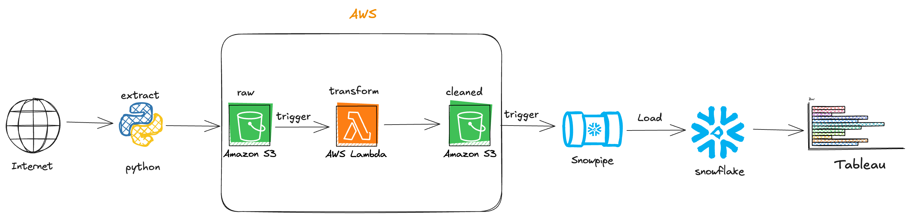
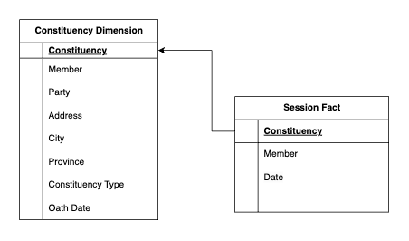

# Pakistan Senate Sessions Attendance | Data Engineering Project

## Purpose 
The data engineering project is about finding interesting insights from a country's Senate website. The website contains data about the session and the members/senators who were present in it. Senators information, e.g., names, constituencies, party, province/state, and the city are also available. The project aims to blend all of this for interesting insights like which party's senators participate in the sessions regularly, individual senator participating trends, city or state/province-wise participation, etc. 

## Introduction 
In this data engineering project, we leverage Amazon S3 and AWS Lambda to create a scalable and efficient data processing pipeline. Amazon S3 serves as our primary storage solution, enabling us to store and manage vast amounts of data securely. AWS Lambda facilitates serverless computing, allowing us to execute code responding to events, such as data uploads, for real-time processing and transformation. The processed data is then ingested into Snowflake, our cloud-based data warehouse, which can be seamlessly queried and analyzed. Finally, we utilize Tableau for dynamic data visualization, empowering stakeholders to explore insights and trends interactively. 

## Directory contents:
 - Screenshots 
   Contains Tableau dashboard screenshots.
   
 - Scripts
   Python scripts for extraction from website, transformation/cleaning in the lambda function.
   
 - Scraped data in the raw format in the below directories.

    1. members_attendance_raw
    2. members_details_raw
       
 - Cleaned/Transformed data in the below directories.  
     1. members_attendance_cleaned
     2. members_details_cleaned
     3. validation_&_merge
       
   
## Architecture 

## Technologies Used
1. Programming Language  - Python
2. Scripting Language - SQL
3. AWS
   - Lambda
   - S3
4. Snowflake ( Data Warehouse )
5. Tableau ( Visualization )

## Data Model:

## Dataset Used:

Data is scraped from the website, https://www.na.gov.pk/en/all-members.php and https://www.na.gov.pk/en/attendance2.php, using Python's BeautifulSoup4 Library. 

- https://github.com/sherafgunmetla/pak-senate-data-engineering/blob/main/members_details_raw/2024-09-25.csv
- https://github.com/sherafgunmetla/pak-senate-data-engineering/tree/main/members_attendance_raw

### More about the dataset
There are 2 datasets. First one contains the members details e.g Name, Constituency, Address, City, Province & Party. The second one is member's attendance in the session, in the form of pdf files, which are uploaded when the session is held. 

## Scrips for the project

1. [Scrap Scripts](https://github.com/sherafgunmetla/pak-senate-data-engineering/tree/main/Scripts/Scrap)
2. [Cleaning & Transforming Scripts](https://github.com/sherafgunmetla/pak-senate-data-engineering/tree/main/Scripts/Transform)
3. [Snowflake](https://github.com/sherafgunmetla/pak-senate-data-engineering/blob/main/snowflake_query.sql)

## Tableau Visualization  

https://public.tableau.com/app/profile/sher.afgun/viz/PakistanSenateAttendance-2024onwards/Dashboard1

## Key insights I found:  

▷ Around 65% of the Senators are generally present in the sessions, meaning a substantial number are often absent, and the house rarely has a full attendance.
▷ Sessions with a higher attendance rate mostly occur in June and September. The reason might be that the country's budgets and a constitutional amendment were passed in the respective months.
▷ The Leader of the Opposition was present in 78% of the sessions, while the Leader of the House attended only 20% of the time. This substantial difference may be attributed to the latter being busy with other government matters, such as an official foreign tour.

## ! UPDATE ! 
To keep the tableau dashboard up to date, I have replaced the snowflake with Google Sheets, for live data. Now the data is being dumped to Google Sheets instead of Snowflake. This change is because Tabluea requires a paid version for live data.
